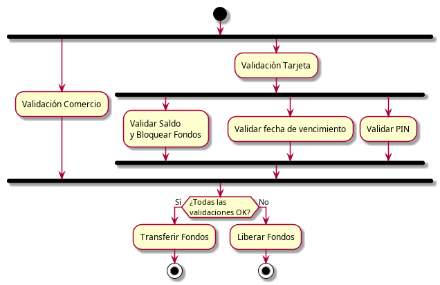
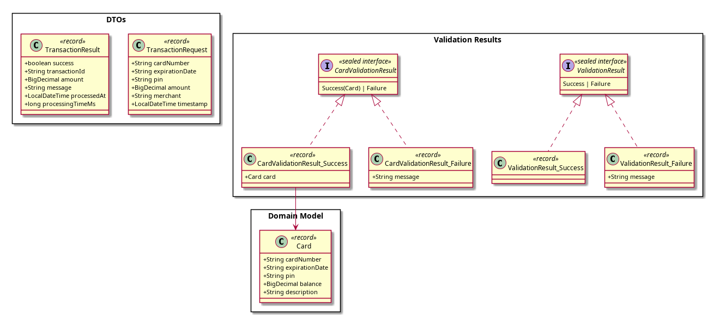
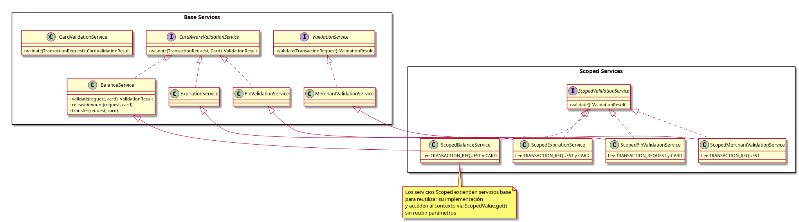
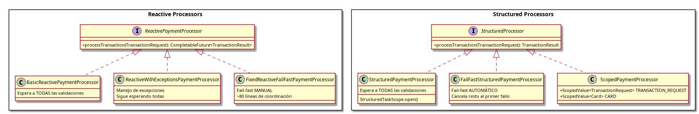

# Structured Concurrency & Scoped Values - Java 25

Material de demostración para JConf 2025


## Acerca del Repositorio

Este repositorio contiene material de demostración para una presentación sobre **Structured Concurrency** y **Scoped Values** en Java 25.

**Contenido:**
- Aplicación Java con demos comparativos de diferentes enfoques de concurrencia
- [Presentación LaTeX con transparencias de la charla](presentacion/structured-concurrency-presentation.tex), [ver pdf](presentacion/structured-concurrency-presentation.pdf)

**Propósito:** Comparar y contrastar diferentes enfoques para manejar concurrencia en Java, desde programación reactiva tradicional (CompletableFuture) hasta las nuevas características de Java 25 (Structured Concurrency y Scoped Values).

**:information_source: Nota:** 
> Este README es trabajo en progreso, aún faltan secciones comentando el código auxiliar y explicación de la UI, puedes agregar este repositorio a tu watch list de GitHub (voy a notificar mediante una discusión cada vez que haga un commit relevante) o seguirme en [LinkedIn](https://www.linkedin.com/in/andresalcarraz/) para enterarte cuando lo vaya completando.
> 
> Esta versión permite entender los puntos de entrada a las clases que implementan la parte más relevante de la presentción.

---

## El Caso de Uso: Procesamiento de una transacción de compra

Para efectos de demostración, supongamos un caso simplificado de procesamiento de compras.  

Para validar la transacción hay varias cosas que se pueden hacer en paralelo, por ejemplo, la validación de los datos del comercio se pueden hacer en paralelo con la validación del consumidor.

En este flujo, asumimos que se necesita validar la tarjeta para obtener la cuenta que se usará para validar que tiene el saldo suficiente, el PIN asociado y la fecha de expiración. Cada parte la valida un servicio distinto.  

### Flujo de Validación



**Desafío:** ¿Cómo coordinamos estas validaciones paralelas de forma clara, segura y eficiente?

---

## Servicios de Validación

Cada validación del flujo está implementada por un/pl servicio especializado. Estos servicios simulan operaciones de red con retrasos definidos en constantes para poder observar el comportamiento de los diferentes enfoques de concurrencia.

**:information_source: Nota:** Si bien todos los servicios de validación del consumidor usan el mismo repositorio para simplificar el ejemplo. En la realidad es razonable que estén implementados por servicios diferentes, por ejemplo, uno de contabilidad para el saldo y un [HSM](https://es.wikipedia.org/wiki/HSM) para el PIN.
Lo más forzado es la fecha de vencimiento, que normalmente se guardaría en la misma entidad que la info de la tarjeta. Un ejemplo más apropiado sería la validación de CVV, que involucra también al HSM pero se puede ejecutar en paralelo con el PIN, pues es un comando separado.

### Servicios Involucrados

1. **MerchantValidationService**
   - **Propósito:** Valida el comercio, en el ejemplo, que no contenga `BLOCKED`
   - **Retraso simulado:** 500ms
   - **Implementación:** [`MerchantValidationService.java`](demo-structured-concurrency/src/main/java/com/example/services/MerchantValidationService.java)

2. **CardValidationService**
   - **Propósito:** Valida el número de tarjeta y recupera los datos de la cuenta
   - **Retraso simulado:** 100ms
   - **Retorna:** Objeto `Card` con saldo, PIN y fecha de vencimiento
   - **Implementación:** [`CardValidationService.java`](demo-structured-concurrency/src/main/java/com/example/services/CardValidationService.java)

3. **BalanceService**
   - **Propósito:** Valida saldo disponible e implementa bloqueo de fondos (two-phase commit)
   - **Retraso simulado:** 600ms (el más lento)
   - **Mecanismo especial:**
     - `validate()` - Valida el saldo y si tiene fondos, bloquea fondos agregándolos a transacciones pendientes
     - `releaseAmount()` - Libera fondos si otra validación falla, este método no tiene ningún efecto si no se bloqueó el fondo en la transacción actual
     - `transfer()` - Debita el saldo si todas las validaciones pasan
   - **Implementación:** [`BalanceService.java`](demo-structured-concurrency/src/main/java/com/example/services/BalanceService.java)

4. **ExpirationService**
   - **Propósito:** Valida que la tarjeta no esté vencida
   - **Retraso simulado:** 200ms
   - **Implementación:** [`ExpirationService.java`](demo-structured-concurrency/src/main/java/com/example/services/ExpirationService.java)

5. **PinValidationService**
   - **Propósito:** Valida que el PIN sea correcto
   - **Retraso simulado:** 300ms
   - **Implementación:** [`PinValidationService.java`](demo-structured-concurrency/src/main/java/com/example/services/PinValidationService.java)

### Modelo de Datos



El modelo de datos está organizado en packages:
- **DTOs**: Request del cliente y su respuesta
- **Domain Model**: `Card` tiene la info necesaria para validar los datos de la tarjeta 
- **Validation Results**: Sealed interfaces para resultados (ValidationResult y CardValidationResult), en el caso de validación exitosa del número tarjeta, se devuelve la entidad con los datos de la tarjeta. 

### Interfaces y Servicios de Validación



Los servicios de validación están organizados por interfaces:
- **ValidationService**: Para validaciones simples
- **CardAwareValidationService**: Para validaciones que requieren datos de tarjeta, se pasa la tarjeta obtenida por `CardValidationService`

---

## Procesadores Implementados

Este proyecto implementa el flujo anterior usando diferentes paradigmas de concurrencia. Los procesadores están organizados desde los más simples hasta los más sofisticados.
### Diagrama de clases

Todos los procesadores implementan el mismo flujo de validación pero con diferentes paradigmas de concurrencia:



**Características de cada tipo:**

- **Reactive Processors (CompletableFuture)**:
    - [`BasicReactivePaymentProcessor`](#basicreactivepaymentprocessor): Espera todas las validaciones con `allOf()`
    - [`ReactiveWithExceptionsPaymentProcessor`](#nota-sobre-reactivewithexceptionspaymentprocessor): Muestra que la idea de fallo temprano automático de [`StructuredPaymentProcessor`](#failfaststructuredpaymentprocessor) no es tan simple para programación reactiva..
    - [`FixedReactiveFailFastPaymentProcessor`](#fixedreactivefailfastpaymentprocessor): Intenta implementar fallo temprano con programación reactiva, código más complejo.

- **Structured Processors (StructuredTaskScope)**:
    - [`StructuredPaymentProcessor`](#structuredpaymentprocessor): Espera todas con gestión automática del ciclo de vida
    - `FailFastStructuredPaymentProcessor`: Fail-fast automático al primer fallo, usando excepciones cuando los servicios no validan.

- **Scoped Processors (Scoped Values)**:
    - [`ScopedPaymentProcessor`](#scopedpaymentprocessor): Usa ScopedValue para propagación de contexto
    - Servicios scoped acceden al contexto sin necesidad de recibir todos los parámetros.

---
### Procesadores Básicos (Await-All)

Estos procesadores esperan a que **todas** las validaciones terminen, independientemente de si alguna de las paralelas falla antes.

#### BasicReactivePaymentProcessor

**Enfoque:** CompletableFuture (programación reactiva tradicional)

- **Archivo:** [`BasicReactivePaymentProcessor.java`](demo-structured-concurrency/src/main/java/com/example/reactive/BasicReactivePaymentProcessor.java)
- **Qué hace:** Usa `CompletableFuture.allOf()` para ejecutar validaciones en paralelo
- **Demo CLI:** `./gradlew demoReactive`
- **Endpoint REST:** `/api/reactive/basic`

**Ejemplo de código:**
```java
// BasicReactivePaymentProcessor.java (líneas 54-90)
CompletableFuture<ValidationResult> merchantValidation =
    CompletableFuture.supplyAsync(() ->
        merchantValidationService.validate(request));

CompletableFuture<Card> cardValidation =
    CompletableFuture.supplyAsync(() ->
        cardValidationService.validate(request))
    .thenCompose(cardResult -> {
        // Validaciones paralelas anidadas...
    });

CompletableFuture.allOf(merchantValidation, cardValidation).join();
```

#### StructuredPaymentProcessor

**Enfoque:** Structured Concurrency (Java 25)

- **Archivo:** [`StructuredPaymentProcessor.java`](demo-structured-concurrency/src/main/java/com/example/structured/StructuredPaymentProcessor.java)
- **Qué hace:** Usa `StructuredTaskScope.open()` para organizar tareas en jerarquía
- **Demo CLI:** `./gradlew demoStructured`
- **Endpoint REST:** `/api/structured/normal`
- **Líneas clave:** 63-97

**Ejemplo de código:**
```java
// StructuredPaymentProcessor.java (líneas 63-97)
try (var globalScope = StructuredTaskScope.open()) {
    Subtask<ValidationResult> merchantValidation =
        globalScope.fork(() ->
            merchantValidationService.validate(request));

    Subtask<CardValidationResult> cardValidation =
        globalScope.fork(() -> {
            // Scope anidado para validaciones del consumidor...
        });

    globalScope.join(); // Espera a TODAS las subtareas
}
```

---

### Procesadores Fail-Fast (Cancelación al Primer Fallo)

Estos procesadores cancelan todas las tareas restantes tan pronto como detectan un fallo.

#### Nota sobre ReactiveWithExceptionsPaymentProcessor

El procesador [`ReactiveWithExceptionsPaymentProcessor.java`](demo-structured-concurrency/src/main/java/com/example/reactive/ReactiveWithExceptionsPaymentProcessor.java) añade manejo de excepciones a la versión reactiva básica, pero **no soluciona el problema fundamental**: cuando una tarea lanza una excepción, las demás tareas continúan ejecutándose hasta completarse. No hay cancelación automática.

- **Demo CLI:** `./gradlew demoReactiveExceptions`
- **Endpoint REST:** `/api/reactive/with-exceptions`

#### FixedReactiveFailFastPaymentProcessor

**Enfoque:** CompletableFuture con fail-fast MANUAL

- **Archivo:** [`FixedReactiveFailFastPaymentProcessor.java`](demo-structured-concurrency/src/main/java/com/example/reactive/FixedReactiveFailFastPaymentProcessor.java)
- **Qué hace:** Implementa fail-fast manualmente con CompletableFuture
- **Complejidad:** Requiere ~80 líneas de código de coordinación para lograr cancelación al primer fallo
- **Demo CLI:** `./gradlew demoFixedReactiveFailFast`
- **Endpoint REST:** `/api/reactive/fail-fast`

#### FailFastStructuredPaymentProcessor

**Enfoque:** Structured Concurrency con fail-fast AUTOMÁTICO

- **Archivo:** [`FailFastStructuredPaymentProcessor.java`](demo-structured-concurrency/src/main/java/com/example/structured/FailFastStructuredPaymentProcessor.java)
- **Qué hace:** Cancela automáticamente todas las tareas restantes al primer fallo
- **Ventaja:** La cancelación es automática, sin código de coordinación manual
- **Demo CLI:** `./gradlew demoStructuredFailFast`
- **Endpoint REST:** `/api/structured/fail-fast`
- **Líneas clave:** 67-103

**Ejemplo de código:**
```java
// FailFastStructuredPaymentProcessor.java (líneas 67-103)
try (var globalScope = StructuredTaskScope.open()) {
    globalScope.fork(() -> {
        ValidationResult result = merchantValidationService.validate(request);
        if (result instanceof ValidationResult.Failure(String msg)) {
            throw new ValidationException(msg); // → Cancela automáticamente el resto
        }
    });

    globalScope.join();
} catch (StructuredTaskScope.FailedException e) {
    // Manejo automático de fallo
}
```

**Comparación de demos:**
```bash
# Comparar comportamiento await-all vs fail-fast
./gradlew demoCompare

# Comparar específicamente el comportamiento en caso de fallo
./gradlew demoCompareFailure
```

---

### Propagación de Contexto con Scoped Values

**Ubicación:** `demo-structured-concurrency/src/main/java/com/example/scopedvalues/`

Los `ScopedValue` permiten propagar contexto a través de hilos virtuales sin necesidad de pasar parámetros explícitamente, evitando el "parameter drilling" (pasar el mismo parámetro a través de múltiples capas de llamadas).

#### ScopedPaymentProcessor

- **Archivo:** [`ScopedPaymentProcessor.java`](demo-structured-concurrency/src/main/java/com/example/scopedvalues/ScopedPaymentProcessor.java)
- **Qué hace:** Usa `ScopedValue` para establecer contexto que los servicios pueden acceder sin recibir parámetros
- **Demo CLI:** `./gradlew demoScopedValues`
- **Endpoint REST:** `/api/scoped/fail-fast`
- **Líneas clave:** 21-22 (definición de ScopedValues), 44-111 (uso)

#### Servicios que acceden al contexto

Los siguientes servicios acceden al contexto vía `ScopedValue.get()`:
- [`ScopedCardValidationService.java`](demo-structured-concurrency/src/main/java/com/example/scopedvalues/ScopedCardValidationService.java)
- [`ScopedBalanceService.java`](demo-structured-concurrency/src/main/java/com/example/scopedvalues/ScopedBalanceService.java)
- [`ScopedExpirationService.java`](demo-structured-concurrency/src/main/java/com/example/scopedvalues/ScopedExpirationService.java)
- [`ScopedPinValidationService.java`](demo-structured-concurrency/src/main/java/com/example/scopedvalues/ScopedPinValidationService.java)
- [`ScopedMerchantValidationService.java`](demo-structured-concurrency/src/main/java/com/example/scopedvalues/ScopedMerchantValidationService.java)

#### Ejemplo de Código Scoped Values

```java
// ScopedPaymentProcessor.java (líneas 21-22)
// Definición de los ScopedValues
public static final ScopedValue<TransactionRequest> TRANSACTION_REQUEST =
    ScopedValue.newInstance();
public static final ScopedValue<Card> CARD =
    ScopedValue.newInstance();

// Establecer contexto (líneas 44-68)
ScopedValue.where(TRANSACTION_REQUEST, request).call(() -> {
    try (var globalScope = StructuredTaskScope.open()) {
        // Los servicios acceden vía TRANSACTION_REQUEST.get()
        createValidationTask(merchantValidationService, globalScope);
        // ...
    }
});

// ScopedBalanceService.java - Acceso al contexto sin parámetros
ValidationResult validate() {
    return super.validate(
        ScopedPaymentProcessor.TRANSACTION_REQUEST.get(),
        ScopedPaymentProcessor.CARD.get()
    );
}
```

---

## Inicio Rápido

### Ejecutar Demos desde Línea de Comandos

```bash
cd demo-structured-concurrency

# Reactive Programming
./gradlew demoReactive
./gradlew demoReactiveExceptions
./gradlew demoFixedReactiveFailFast

# Structured Concurrency
./gradlew demoStructured
./gradlew demoStructuredFailFast

# Scoped Values
./gradlew demoScopedValues

# Comparaciones
./gradlew demoCompare
./gradlew demoCompareFailure
```

### Ejecutar Aplicación Web (con Interfaz Gráfica)

```bash
cd demo-structured-concurrency
./gradlew quarkusDev

# Abrir en navegador: http://localhost:8080
```

### Probar Endpoints REST

```bash
curl -X POST http://localhost:8080/api/structured/fail-fast \
  -H "Content-Type: application/json" \
  -d '{
    "cardNumber": "1234-5678-9012-3456",
    "expirationDate": "1225",
    "pin": "1234",
    "amount": 100.00,
    "merchant": "Demo Store"
  }'
```

---

## Requisitos

- **Java 25** con `--enable-preview` habilitado
- **Gradle** (wrapper incluido en el proyecto)

El proyecto ya está configurado para habilitar las preview features automáticamente en `build.gradle`.

---

## Estructura del Repositorio

```
jconf-structured-concurrency/
├── README.md                       # Este archivo
│
├── demo-structured-concurrency/    # Aplicación Java
│   ├── src/main/java/com/example/
│   │   ├── reactive/              # Procesadores CompletableFuture
│   │   │   ├── BasicReactivePaymentProcessor.java
│   │   │   ├── ReactiveWithExceptionsPaymentProcessor.java
│   │   │   └── FixedReactiveFailFastPaymentProcessor.java
│   │   │
│   │   ├── structured/            # Procesadores StructuredTaskScope
│   │   │   ├── StructuredPaymentProcessor.java
│   │   │   └── FailFastStructuredPaymentProcessor.java
│   │   │
│   │   ├── scopedvalues/          # Procesadores ScopedValue
│   │   │   ├── ScopedPaymentProcessor.java
│   │   │   └── Scoped*Service.java
│   │   │
│   │   ├── services/              # Servicios de validación
│   │   ├── rest/                  # REST controllers
│   │   ├── model/                 # Records (TransactionRequest, etc)
│   │   └── demos/                 # Clases ejecutables para demos CLI
│   │
│   ├── src/main/resources/
│   │   └── META-INF/resources/
│   │       └── index.html         # Interfaz web
│   │
│   └── build.gradle
│
└── presentacion/                   # Presentación LaTeX
    ├── structured-concurrency-presentation.tex
    ├── Makefile
    └── sections/
```

---

## Licencia

Material educativo para JConf 2025.

**Autor:** Andrés Alcarraz
**Contacto:** alcarraz@gmail.com
